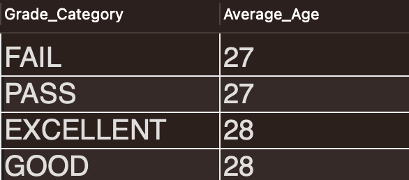
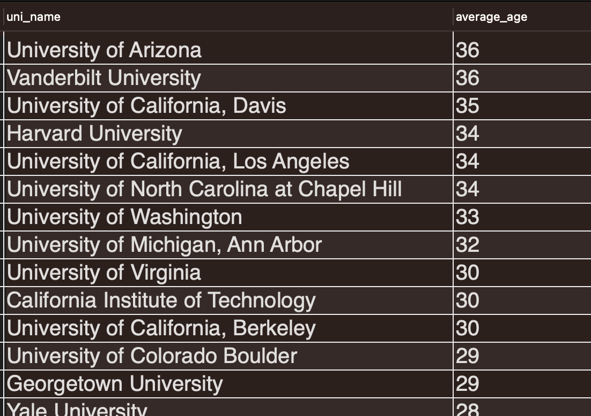
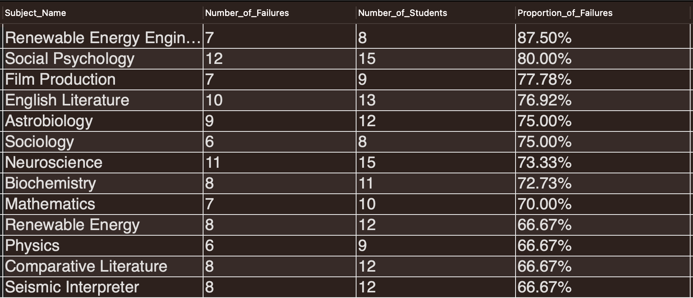
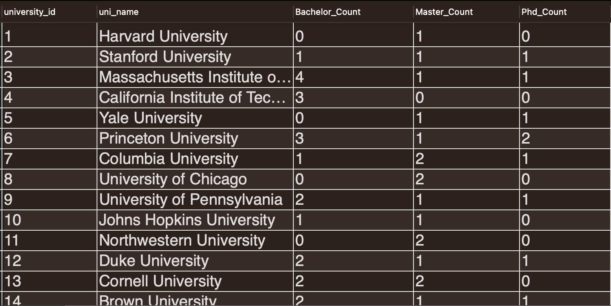
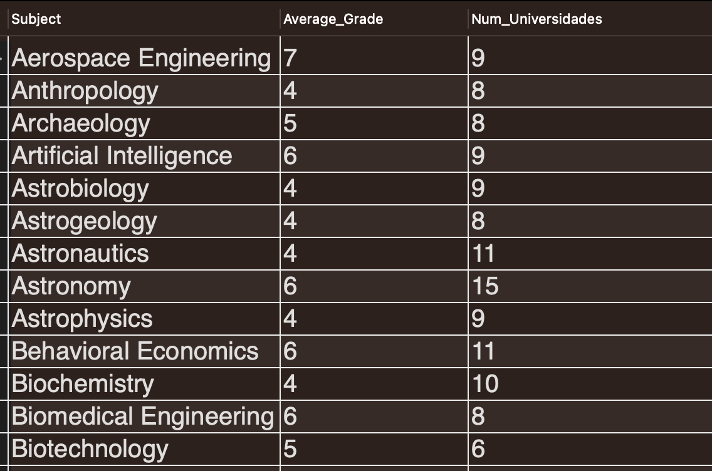
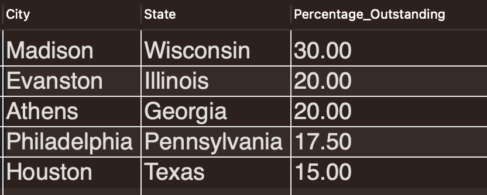
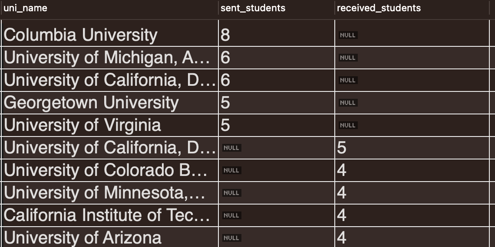
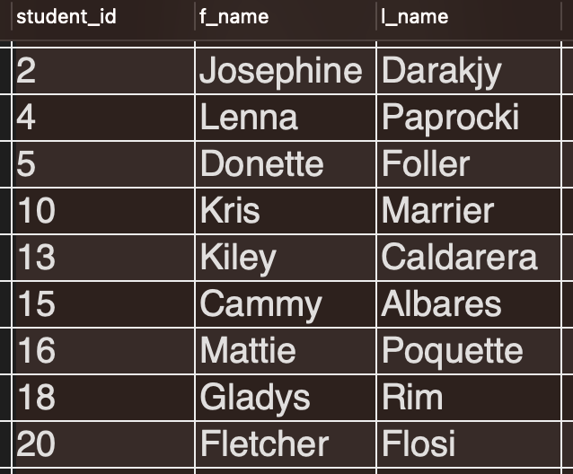
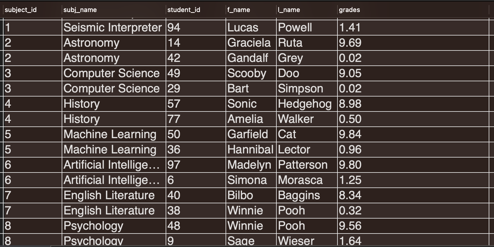
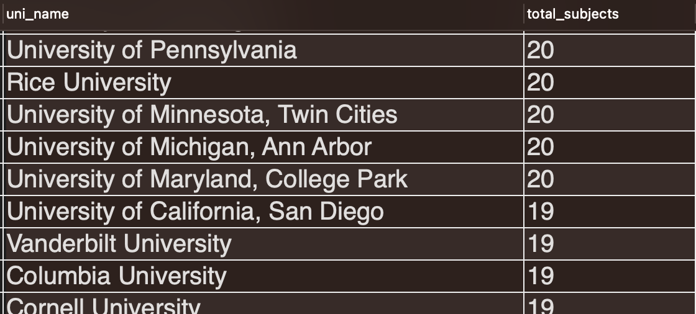

# Lab | Erasmus

Using the erasmus database, answer the following questions. The database has the following structure:

1. What is the average age of students who have outstanding grades? Provide the table with EXCELLENT if they have a 9 or 10, GOOD if they have 7 or 8, PASS if they have a 5 or 6, and FAIL if it is less than 5.

2. What is the average age of students by university?

3. What is the proportion of students who failed each subject? Provide the subject name, number of students who failed, total number of students, and the proportion of students who failed (as a percentage) for each subject. Display the results in descending order of the proportion of students who failed.

4. What is the average grade of students who have done an erasmus compared to those who have not?

5. For each university, identify the number of bachelor's, master's and PhD degrees awarded.Provide the university ID and name along with the count for each type of degree.

6. Which are the top 5 universities with the highest average ranking over the years? Provide the University ID, University Name, and Average Ranking.

7. Provide de id, the name, the last name, the name of the home university and the email of the 10 students that have been on an international agreement more times.

8. Make a query where, by modifying the international agreement number, you can identify the id and name of the student who did the exchange, the name of the home university and the name of the city where the exchange took place.

Bonus: Now you can try to use procedures to parameterize the query. https://learn.microsoft.com/es-es/sql/t-sql/statements/create-procedure-transact-sql?view=sql-server-ver16

9. Find and display the number of universities offering each subject, along with the average grade for each subject.

10. Find the top 5 cities with the highest percentage of students who have outstanding grades (9 or 10). Provide the city, state, and the percentage of outstanding students for each city.

11. Compare the universities that send the most students with the universities that receive the most students. Do it in 2 queries.

Bonus: Now you can try to join both queries by using "UNION ALL" operator.

12. Create a CTE that lists all students who have not signed any international agreements. Include the columns student_id, f_name, and l_name. Then, write a query to select all the rows from the CTE.

13. Write a SQL query to rank universities based on their international ranking for the year 2022 in descending order. Include the following columns in the result: uni_name, intl_ranking, and the rank assigned using the window function.

14. Write a query to find the students who have the highest and lowest grades for each subject. Include the columns subject_id, subj_name, student_id, f_name, l_name, and grades. Use window functions to rank the students within each subject based on their grades.

15. Create a CTE that calculates the total number of subjects offered by each university. Include the columns uni_name and total_subjects. Then, write a query to select all the rows from the CTE in descending order of total subjects.

